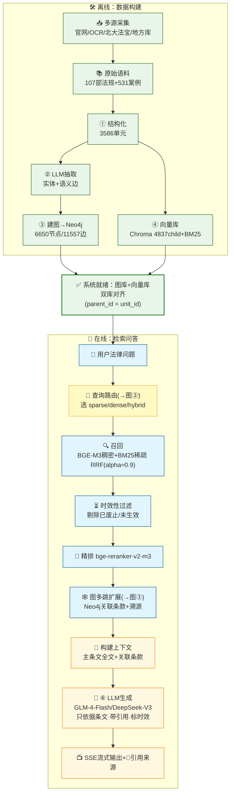
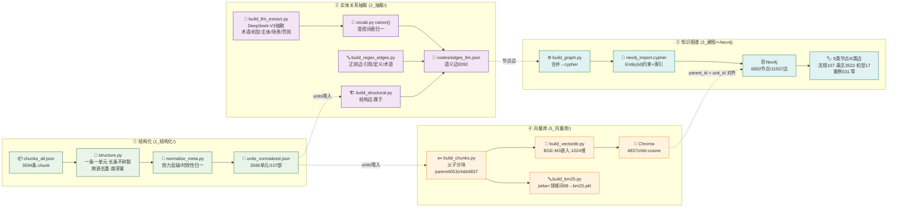
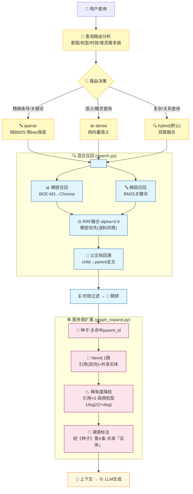

# 低空经济无人机法律智能问答系统 —— 数据框架图

> 基于 **GraphRAG（知识图谱增强检索 + 大模型生成）** 的中国无人机法律法规问答系统。
> 为避免单张图过于繁琐，框架拆成三张图：
> **① 系统总览（主图，含所有环节）** → **② 离线构建管线（细节）** → **③ 在线检索细节**。
>
> 对应的 draw.io 文件 [`数据框架图.drawio`](数据框架图.drawio) 内含同名三个页面（Tab）。
> Mermaid 图可在 GitHub / Typora / VS Code(Mermaid 插件) 中直接渲染。

---

## 图① 系统总览（主图）

一张图看清所有环节：上半为**离线数据构建**（①~④），下半为**在线检索问答**（路由→召回→过滤→精排→图扩展→生成）。虚线块（🧭查询路由、🕸️图扩展）的内部实现见图②③。



---

## 图② 离线构建管线（细节）

四个阶段各自的脚本与产物；虚线为跨阶段的数据流转，红线为 GraphRAG 的**双库对齐关键**。



---

## 图③ 在线检索细节（路由 + 召回 + 图扩展）

主图中「🧭查询路由」和「🕸️图扩展」两个虚线块的内部展开。



---

## 数据流说明

### 离线（图②）

| 阶段 | 目录 | 输入 → 输出 | 关键产物 |
|------|------|-------------|----------|
| **① 结构化** | `1_结构化/` | chunks_all(3594) → 结构化单元 | `units_normalized.json` 3586单元/107部 |
| **② LLM抽取** | `2_抽取/` | 单元 → 实体+关系 | 术语/机型/主体/场景/罚则 + 语义边8392 |
| **③ 建图** | `3_建图/`+Neo4j | 节点边 → cypher → 图库 | **Neo4j 6650节点/11557边** |
| **④ 向量库** | `5_向量库/` | 单元 → 父子分块 → 嵌入 | **Chroma 4837 child** + BM25 |

> **双库对齐**：向量库 `parent_id` == 图库 `Article.id` == `unit_id`，是「向量召回 ↔ 图扩展」合流的连接键。

### 在线（图③）

```
用户查询
  → 🧭 查询路由：判定意图/机型/时效，选召回策略
      · 精确条号/关键词 → sparse(纯BM25·免key保底)
      · 语义/概念查询   → dense(纯向量)
      · 复杂/关系查询   → hybrid(双路融合，默认)
  → 双路召回 BGE-M3稠密(Chroma)+BM25稀疏 ──RRF融合(alpha≈0.9)
  → 时效性过滤(剔除已废止/未生效) → bge-reranker 精排
  → Neo4j 图多跳扩展(引用/共享实体，稀有度降权，带溯源)
  → 构建上下文 → LLM生成(带引用/标时效)
```

---

## 三种模型分工

| 环节 | 模型 | 作用 |
|------|------|------|
| 召回嵌入 | **BGE-M3**（1024维，SiliconFlow API） | 稠密语义召回 |
| 精排 | **bge-reranker-v2-m3**（cross-encoder） | 二阶段精排 |
| 生成 | **GLM-4-Flash / DeepSeek-V3** | 依据条文出带引用答案 |

## 关键技术参数

| 环节 | 参数 |
|------|------|
| 语料规模 | 107部法规 + 531案例 |
| 结构化单元 | 3586 单元 |
| 知识图谱 | 6650 节点 / 11557 边（9类节点 / 6类边） |
| 父子分块 | parent 4053 / child 4837 |
| 嵌入模型 | BGE-M3，1024 维，cosine |
| 融合算法 | RRF，alpha≈0.9 稠密优先 |
| 图扩展 | Neo4j 1跳，引用边×3，高频实体 1/log2(2+deg) 降权 |
| 时效过滤 | 现行有效 / 已废止 / 已修改 / 未生效 四态 |
